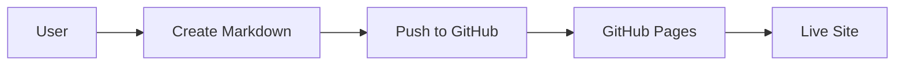
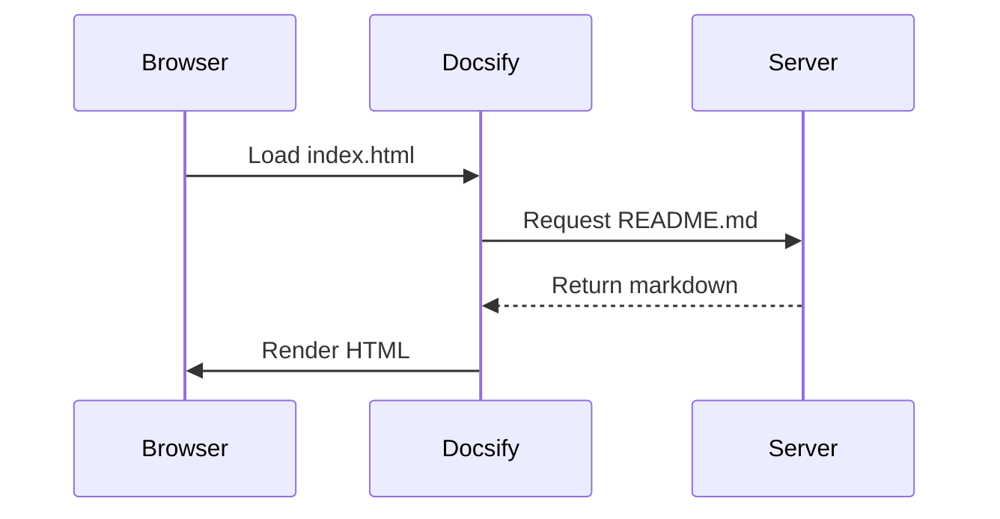

# Sample Page 2: Advanced Features

This page shows more advanced Docsify features and real-world examples.

## Alerts and Notices

Docsify supports special alert syntax:

> [!NOTE]
> This is a note - useful for highlighting important information.

> [!TIP]
> Pro tip: Use the search bar to quickly find what you need!

> [!WARNING]
> Warning: Make sure you include the `.nojekyll` file when deploying to GitHub Pages.

> [!DANGER]
> Danger: Never commit API keys or secrets to your repository!

## Collapsible Sections

<details>
<summary>Click to expand: What is Docsify?</summary>

Docsify is a documentation site generator that works entirely in the browser. Unlike static site generators like Jekyll or Hugo, Docsify:

- Doesn't require a build step
- Loads markdown files dynamically
- Renders content on the fly
- Makes updates instant

</details>

<details>
<summary>Click to expand: Installation Options</summary>

You have multiple options for installation:

1. **No installation** - Just create `index.html` with CDN links
2. **CLI tool** - `npm install docsify-cli -g`
3. **Manual setup** - Copy files from template

Choose the one that fits your workflow!

</details>

## Embedded Content

### YouTube Video

<iframe width="560" height="315" src="https://www.youtube.com/embed/dQw4w9WgXcQ" frameborder="0" allowfullscreen></iframe>

### CodePen Embed

<p class="codepen" data-height="300" data-theme-id="dark" data-default-tab="html,result" data-slug-hash="example" data-user="example">
  See the Pen Example on CodePen.
</p>

## Syntax Highlighting Examples

### JSON

```json
{
  "name": "docsify-sample",
  "version": "1.0.0",
  "description": "A sample Docsify documentation site",
  "scripts": {
    "serve": "docsify serve docs"
  }
}
```

### YAML

```yaml
name: Deploy Docs
on:
  push:
    branches: [main]
jobs:
  deploy:
    runs-on: ubuntu-latest
    steps:
      - uses: actions/checkout@v2
      - name: Deploy to GitHub Pages
        run: echo "Deploying..."
```

### SQL

```sql
SELECT users.name, COUNT(orders.id) as order_count
FROM users
LEFT JOIN orders ON users.id = orders.user_id
WHERE users.created_at > '2024-01-01'
GROUP BY users.id
ORDER BY order_count DESC
LIMIT 10;
```

### CSS

```css
:root {
  --primary-color: #3498db;
  --secondary-color: #2ecc71;
  --background: #f8f9fa;
}

.custom-button {
  background: var(--primary-color);
  color: white;
  padding: 12px 24px;
  border-radius: 8px;
  border: none;
  cursor: pointer;
  transition: all 0.3s ease;
}

.custom-button:hover {
  background: var(--secondary-color);
  transform: translateY(-2px);
  box-shadow: 0 4px 12px rgba(0,0,0,0.1);
}
```

## Mermaid Diagrams

If you add the Mermaid plugin, you can create diagrams:





## Math Equations

With the MathJax plugin, you can render equations:

Inline equation: $E = mc^2$

Block equation:

$$
\frac{d}{dx}\left( \int_{0}^{x} f(u)\,du\right)=f(x)
$$

## Complex Table

| Language | Paradigm | Typed | Use Case | Popularity |
|----------|----------|-------|----------|------------|
| JavaScript | Multi-paradigm | Dynamic | Web dev | ⭐⭐⭐⭐⭐ |
| Python | Multi-paradigm | Dynamic | Data science, AI | ⭐⭐⭐⭐⭐ |
| TypeScript | Multi-paradigm | Static | Large web apps | ⭐⭐⭐⭐ |
| Rust | Systems | Static | Performance-critical | ⭐⭐⭐ |
| Go | Procedural | Static | Backend services | ⭐⭐⭐⭐ |

## Real-World API Documentation Example

### Authentication Endpoint

**POST** `/api/auth/login`

Authenticate a user and receive an access token.

#### Request Body

```json
{
  "email": "user@example.com",
  "password": "securePassword123"
}
```

#### Response (200 OK)

```json
{
  "success": true,
  "data": {
    "token": "eyJhbGciOiJIUzI1NiIsInR5cCI6IkpXVCJ9...",
    "user": {
      "id": "123",
      "email": "user@example.com",
      "name": "John Doe"
    }
  }
}
```

#### Error Response (401 Unauthorized)

```json
{
  "success": false,
  "error": {
    "code": "INVALID_CREDENTIALS",
    "message": "Email or password is incorrect"
  }
}
```

#### cURL Example

```bash
curl -X POST https://api.example.com/api/auth/login \
  -H "Content-Type: application/json" \
  -d '{"email":"user@example.com","password":"securePassword123"}'
```

## Multi-Column Layout

<div style="display: grid; grid-template-columns: 1fr 1fr; gap: 20px;">
  <div style="border: 1px solid #ddd; padding: 15px; border-radius: 8px;">
    <h3>Column 1</h3>
    <p>This is the first column with some content.</p>
    <ul>
      <li>Point A</li>
      <li>Point B</li>
    </ul>
  </div>
  <div style="border: 1px solid #ddd; padding: 15px; border-radius: 8px;">
    <h3>Column 2</h3>
    <p>This is the second column with different content.</p>
    <ul>
      <li>Point X</li>
      <li>Point Y</li>
    </ul>
  </div>
</div>

## Interactive Elements

### Tabs (with plugin)

If you add the tabs plugin, you can create tabbed content like this:

```markdown
<!-- tabs:start -->

#### **JavaScript**

```javascript
console.log('Hello from JavaScript!');
```

#### **Python**

```python
print('Hello from Python!')
```

#### **Ruby**

```ruby
puts 'Hello from Ruby!'
```

<!-- tabs:end -->
```

## Next Steps

- Go back to [Sample 1](sample1.md)
- Check out the [FAQ](../faq.md)
- Return to [Home](/)
